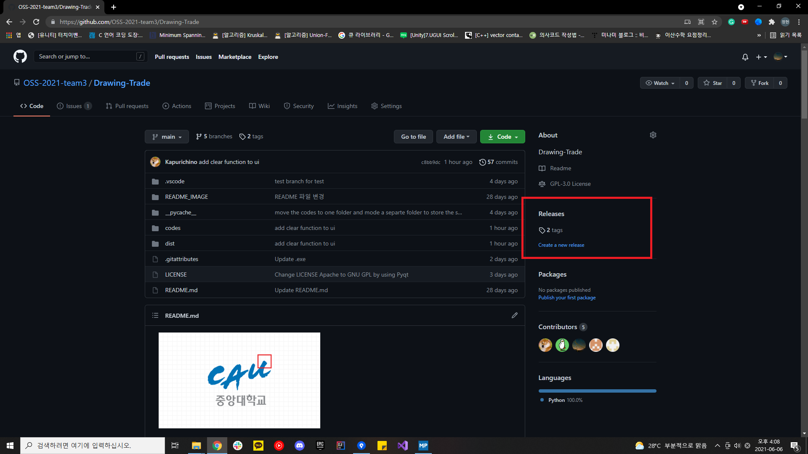
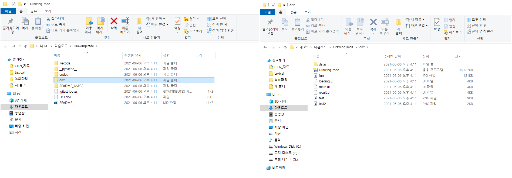
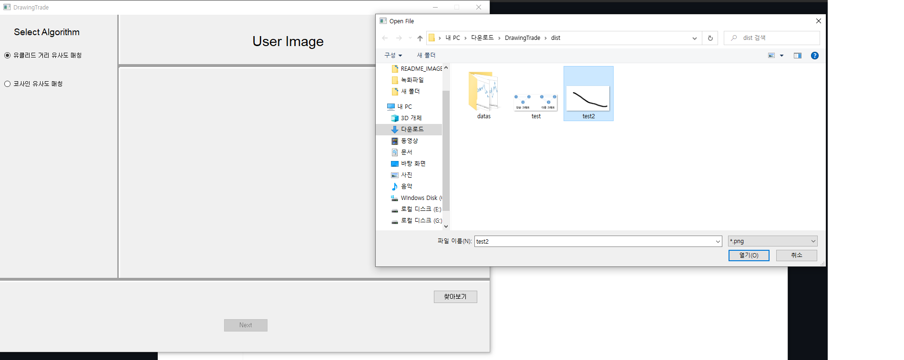
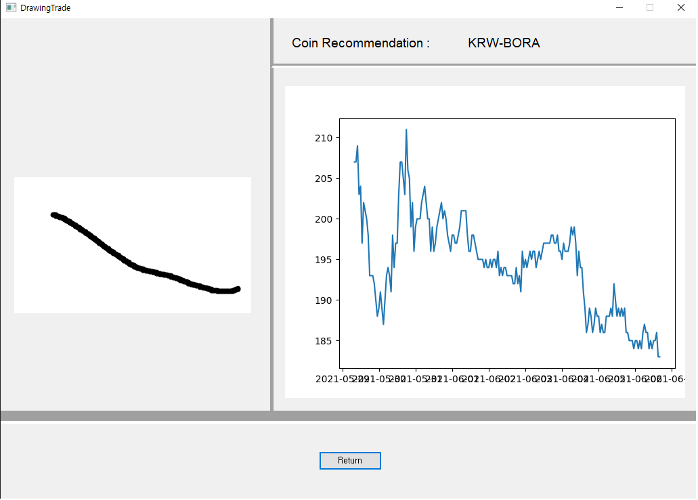

# Drawing Trade  
### 멤버: 김정현, 구태성, 방성원, 임창환  
### OSS 프로젝트  

* *  * 
# 프로그램 실행 방법
1. Release를 클릭한다.

2. DrawingTrade 를 다운받는다.

3. dist 폴더에서 DrawingTrade를 실행한다.

4. 사용할 알고리즘을 고르고 입력할 이미지를 선택한다.

5. 결과를 확인할 수 있다.
