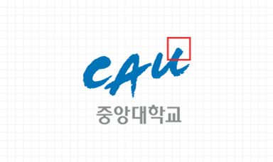
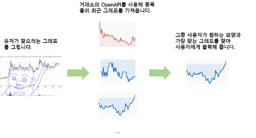
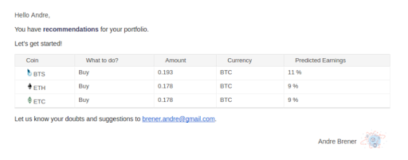
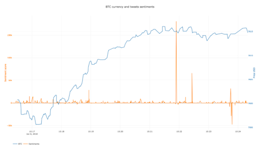

# Drawing Trade  
### 멤버: 김정현, 구태성, 방성원, 임창환  
### OSS 프로젝트  

* *  * 

### o프로젝트 주제  
#### ▪ 배경  
최근 비트코인과 같은 암호화폐에 대한 사람들의 관심이 매우 뜨겁다. 각 사람들은 자신의 기준에 맞게 코인을 매매하는데, 그 기준은 무척이나 다양하다. 
뉴스같은 다양한 외부의 재료나 그외의 일로 인해 가격이 움직이는데 그 전에 정보를 알고 들어가고 싶은 사람들은 매우 많지만, 그 정보를 알 수 있는 사람은 거의 없다.  때문에 더 높은 수익을 노리고 싶은 사람들은 당연하게도 미리 알기 힘든 외부의 재료보다 시각적으로 알기 쉽게 표현되어 있는 차트를 보고 분석하는 사람들이 많다.  
여기서 우리가 만들고 싶은 프로그램을 나타낼 수 있다. 차트를 분석하여, 이익을 실현하고 하는 많은 사람들의 관심으로, 오랫동안 축적된 차트 데이터를 통해 자연스럽게 차트의 형태를 분석하여 미래를 예측하는 사람들이 생겼다. 이러한 사람들이 분석한 결과는, 지금도 사람들이 많이 보고 적용하고 있고 계속해서 분석하고 있으며 다양한 형태의 그래프 패턴이 알려지고 있다. 
우리는 다양한 사람들이 투자 상품을 찾는 요즘시대에 맞게 유저들이 모든 투자 상품의 그래프를 일일이 조사하는것이 아닌 자신이 원하는 그래프를 그리면 유사한 가격 그래프 형태를 갖는 투자상품을 찾게 해주는 프로그램을 만들려고 한다.

#### ▪ 그래프를 바탕으로 찾는 장점(수익 연결)  
예전 주식시장에서는 차트 분석을 이용한 매매 타이밍 예측을 위한 차트 해석기를 설계, 개발하였는데 여러개의 패턴과 베이스의 유용성을 검증하기 위해 1992년부터 1997년간에 과거 한국 주식 시장 실거래 투자 데이터에 대한 실험을 하였다. 실험결과는 평균 투자 성공률이 약 72%로서 투자자들의 투자를 돕는데 우수한 지표로서 사용될 수 있음을 보였다. 게다가이러한 패턴들은 특정 연도나 분야에 따라 예측력이 크게 변하지 않은 독립적인 특성을 가지고 있었다.  
코인시장에서는 기업의 가치나 분야 또는 기업의 성장가능성같은 외부적인 요인을 배제한 차트또는 그래프 만을 보고 분석을 하기 때문에 오히려 주식보다 더 뛰어난 예측력을 기대할 수 있다.  
이를 바탕으로 많은 암호화폐 투자자들이 그래프 분석을 통해 암호화폐에 투자하고 있으며 이하 프로젝트는 이를 보조해줄 도구로써 의의가 있다고 할 수 있다.  

#### ▪ Usage Scenario  
사용자는 github에서 본 프로젝트를 찾아서 사용가능한 프로그램을 다운받을 수 있다.  
사용자는 이 프로그램을 실행하였을 때, 사용자는 원하는 형태의 그래프를 그리거나 외부에서 그래프를 가져 올 수 있다.  
사용자는 본인이 그리거나, 가지고 온 그래프를 사용해 유사한 패턴을 보이는 암호 화폐들을 빠르게 검색 할 수 있다.  
사용자는 그래프의 유사도를 확인하고 검색한 암호화폐의 현재 시세를 확인할 수 있다.  
사용자는 사용중인 프로그램에서 암호화폐를 실시간으로 매매 할 수 있다.   
  
<위 그림> (Usage Scenario의 이해를 돕기 위한 예시)  

▪ MVP(Minimum Viable Product)  
이번 학기중의 오픈소스 프로젝트에서는 사용자가 그래프를 그리면 거래소에서 그래프 데이터를 받아와 비교하고 가장 비슷한 그래프를 유저에게 출력해 주는 것을 개발 목표로 한다.  

* * * 
### o 필요성  
#### ▪ 프로젝트가 필요한 이유와 그 대상  
Pennant, Cup with Handle, Ascending Triangle, Triple Bottom, Bullish Symmetrical Triangle 등 다양한 형태의 차트 패턴들이 존재하고 이를 기준으로 세우거나 자신만의 기준을 가지고 투자를 하는 사람들이 매우 많다. 하지만 이러한 기준을 명확히 가지고 있더라도 그에 맞는 주식 또는 코인을 찾기엔 종류가 매우 많고 이걸 하나하나 찾아보는 것이 매우 힘들기 때문에 자신의 기준에 맞는 주식 또는 코인을 찾는 사람들에게 필요하다.  
기존에 원하는 그래프의 유사도를 측정해서 암호화폐를 검색하는 엔진이나 프로그램은 없었기 때문에 기존과는 다른 분석 방식을 제시할 수 있다. 
 
#### ▪ 오픈소스로 공개하는 것이 필요한 이유  
오픈소스로 공개함으로써 기술을  발전 시킬 수 있는 여지가 많다. 예를들어 그래프 매칭 알고리즘을 더 발전 시킨다 던가 여러가지 다른 변수들을 추가해서 customizable 하게 만든다던가 프로그램 내에서 거래를 할 수 있게 하던가 하는 등 오픈소스 개발을 통해 다양한 방향으로 빠르게 발전 할 수 있다.   
또한 다른 암호화폐 관련 프로젝트에서도 우리의 기술을 사용 할 수 있다. 예를 들어  다른 개발자들이 자신만의 트레이딩 봇을 만들려고 할때 우리의 그래프 매칭 기술을 사용해서 더 정확하고 강력한 봇을 만들 수 있다. 이처럼 다른 프로젝트에서도  우리의 기술을 응용하여 암호화폐 분석 관련 오픈소스 커뮤니티에 새로운 트렌드를 만들고 기여 할 수 있다.  

* * * 
### o 차별성  
#### ▪ 기존에 공개된 오픈소스 SW 조사  
크게 보았을 때, 우리가 고안한 프로젝트는 암호화폐 추천 오픈소스 프로젝트로, 오픈소스 시장에서, 우리의 주제와 유사한 프로젝트들에 대해 소개하려고 한다.  

- Crypto Predictor    
[GitHub 연결](https://github.com/andrebrener/crypto_predictor)  
머신 러닝을 사용하여, 암호화폐의 가격들에 대해 예측하여, 사용자에게 수익을 낼 수 있는 암호화폐를 예상되는 수익을 동반하여, 메일로 리스트를 보내는 오픈소스 소프트웨어. 해당 소프트웨어는, 사용자가 프로젝트를 다운받아, python 패키지를 설치하고, 프로젝트의 python 파일에 본인의 requirements(ex : 본인이 리스트를 받을 e-mail, 본인이 원하는 리스트의 범위 etc..)를 작성하면, 그것에 맞는 리스트를 메일로 보내주는 형식이다.  
<그림> (사용자가 e-mail로 받는 list)  

- TwitterSentimentAndCryptocurrencies  
[GitHub 연결](https://github.com/Drabble/TwitterSentimentAndCryptocurrencies)  
트위터라는 소셜 네트워크 상에서 존재하는 여러 암호화폐 채널을 분석하여, (예를 들어, 각 암호화폐들에 대한 사용자들의 팔로우 수, 리트윗의 수를 분석. 암호화폐들에 대한 트윗이 어떤 내용인지에 대해 분석 etc..) 그것들을 바탕으로 실시간으로 암호 화폐들에 대한 트위터 상에서의 Score(Recommendation에 가깝다)를 그래프를 통해 시각적으로 사용자에게 보여주는 오픈소스 소프트웨어이다.  

<위 그림> (사용자가 시각적으로 제공받는 암호화폐에 대한 그래프) 

#### ▪ 시장조사결과  
암호화폐들에 대해 AI 기술을 통한 분석, 트위터 크롤링 혹은 전문가의 기준에 의해 분석하여 시각적으로 또는 수치적으로 사용자에게 추천해주는 기능들을 가진 다양한 오픈소스 프로젝트들을 확인하였다. 그러나, 우리가 설정한 주제에 맞는,  사용자가 그리는 그래프를 통해 차트를 찾는 프로젝트는 오픈소스 시장에서 찾지 못하였다.

* * *  
### o 개발 방법 및 계획  
#### ▪ 기술  
Github에 있는 OpenCV 라는 오픈소스에서 제공하는 컴퓨터 비전 알고리즘을 통해 이미지간의 유사도를 체크할 수 있다. (Apache 2.0 License)

SourceForge에 있는 Diffimg 라는 오픈소스는 오직 두 이미지간의 차이점을 찾는 오픈소스로 두 이미지를 비교할 수 있다. (GPLv2 License)

위와 같은 참고가 가능한 다른 오픈소스의 이미지 매칭 기술들을 사용해서 그래프 매칭 알고리즘을 개발하려고 한다. 

#### ▪ Problems  
-유저가 그래프를 그리고 이를 데이터화 하는 작업
-그래프 비교 알고리즘 관련 작업
-가상화폐 거래소에서 데이터를 가져와 필요한 데이터로 바꾸는 작업
-그 외의 사용자를 위한 GUI
위와 같은 Problem을 기준으로 일을 배분하여, 팀원 4명 전부 각자 자신의 파트를 맡아 개발 작업에 참여한다. 

##### ▪ Development Schedule  
4/26~5/2 관련 기술 자료 조사 및 python 숙지  
5/3~5/9 각 problem별 핵심 기술 구현  
5/9~5/12 중간 발표   
5/13~5/26 최종 제품 구현  
5/26~6/2 Documentation 및 code test  
6/2~6/9 최종 발표 준비  

위와 같은 개발일정을 가지는 것이 목표이다. 개발일정 관리를 위해 Trello 라는 협업 툴을 사용할 예정이다.  
사용 언어는 거래소에서 제공하는 API와 그래프 비교 알고리즘을 사용하기 위해 python를 사용하여 작업한다.  
VCS로는 가장 큰 오픈소스 커뮤니티 중 하나인 GitHub를 사용한다.  
오픈소스 라이선스로는 암호화폐 오픈소스 커뮤니티의 발전을 위해 자유도가 높은 MIT License를 사용한다.  

* * * * 

### o저작권이나 라이선스 문제, 구체화된 설명  
아래 제시된 Upbit 이용 약관을 통해 비영리목적으로 사용하는 경우 API를 사용할 수 있음을 알 수 있으며, GitHub에 같은 API를 사용한 많은 프로젝트들을 통해 해당 API를 개발에 사용가능함을 알 수 있다.  
Upbit OpenAPI 이용 약관 링크 : [링크](https://url.kr/lep1vq)

### o참고문헌  
[1] 조근식, “캔들스틱 차트 분석을 이용한 주식 매매 타이밍 예측을 위한 전문가 시스템” 한국전문가시스템학회지 제3권 제2호(1997,12) p. 57~60
